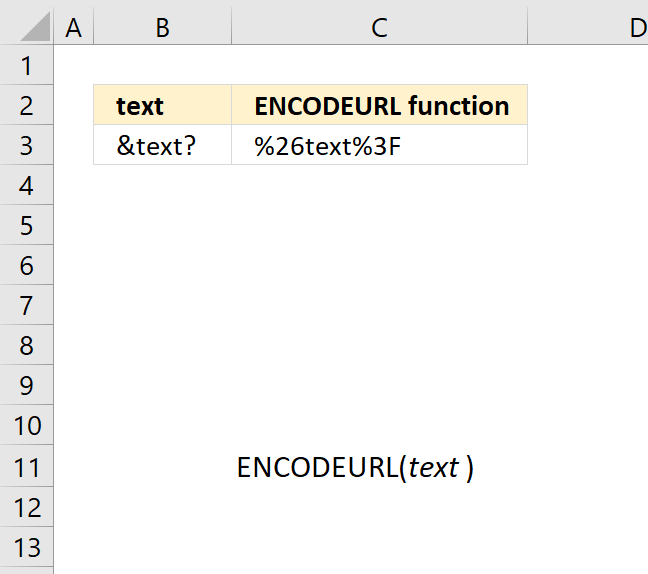
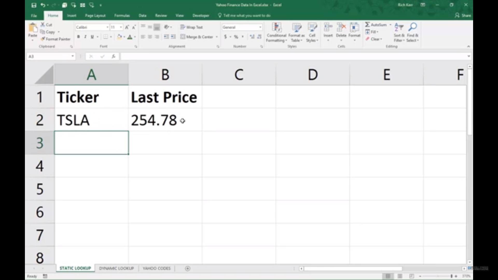
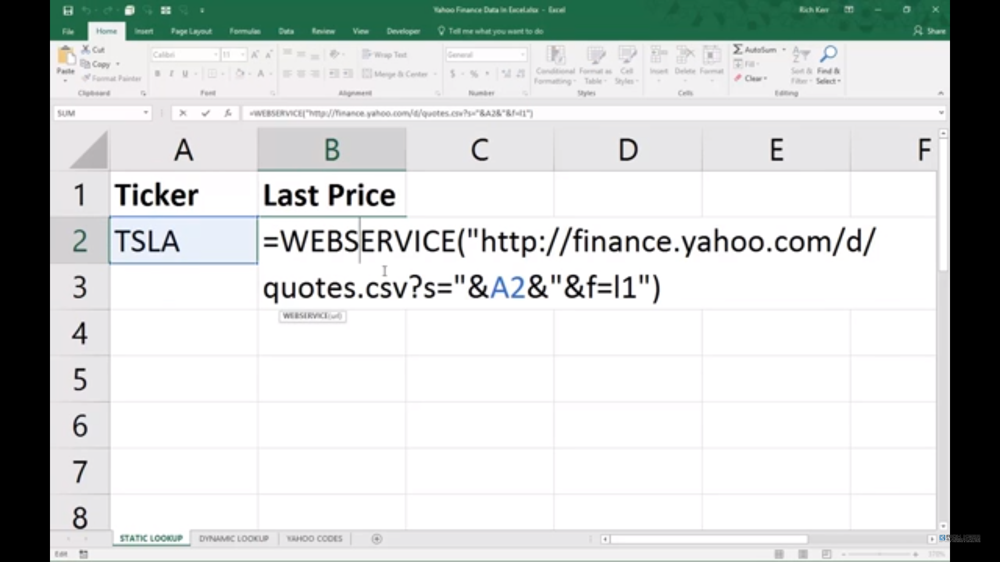
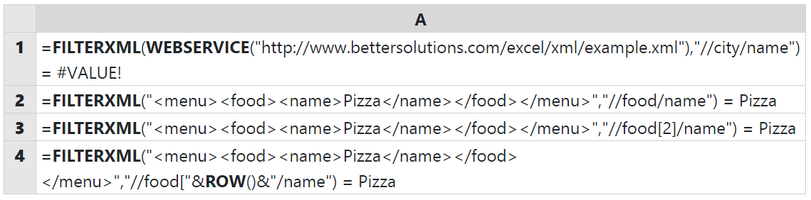

# Fungsi Web

 1. **ENCODEURL**  
Encode url adalah salah satu fungsi Excel yang tidak tersedia dalam Excel Online dan Excel 2016 pada mac. ENCODEURL berfungsi untuk mengembalikan string berkode url.  
Sintaks dari fungsi ini adalah =ENCODEURL\(\) .  
Contoh :  
  

Untuk contoh di atas, kita menggunakan sintaks =ENCODEURL\(B3\)

**2. WEBSERVICE**  
WEBSERVICE adalah fungsi dalam excel yang berguna untuk mengembalikan atau mengambil data dari internet. Fungsi WEBSERVICE memiliki sintaks =WEBSERVICE\(url\).  
Argumen yang diberikan pada WEBSERVICE adalah berupa url. Url yang dapat digunakan adalah url yang memiliki hasil.  
Contoh :  
  

**3. FILTERXML**  
FILTERXML adalah fungsi di excel yang berguna untuk mengembalikan dari konten XML menggunakan Xpath yang telah ditentukan.  
Sintaks dari fungsi ini adalah FILTERXML\(xml, xpath\).  
Xml yang di inputkan harus bernilai valid agar hasil dari fungsi tidak \#VALUE! .  
Contoh : 

