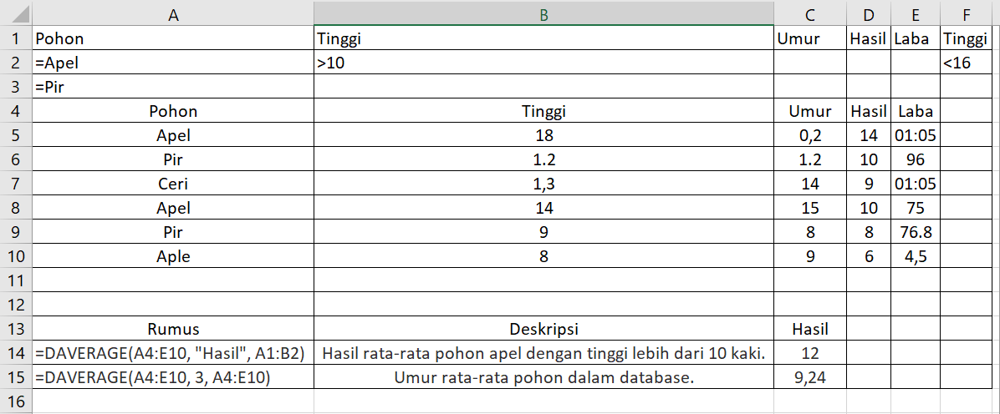

# DAVERAGE

## Apa itu DAVERAGE ?

Fungsi DAVERAGE merupakan salah satu dari fungsi Database.

## Apa fungsi dari DAVERAGE ? 

Menghitung rata-rata nilai dalam bidang \(kolom\) rekaman dalam daftar atau database yang cocok dengan kondisi yang ditentukan.

Mengembalikan rata-rata dari entri database yang dipilih.

## Sintaks

```text
DAVERAGE(database, field, criteria)
```



Adalah rentang sel yang membentuk daftar atau database. Database adalah daftar dari data yang terkait di mana baris-baris informasi terkait adalah rekaman, dan kolom-kolom data adalah bidang. Baris pertama daftar tersebut berisi label untuk masing-masing kolom.



Menunjukkan kolom yang digunakan dalam fungsi tersebut. Masukkan label kolom yang dimasukkan di antara dua tanda kutip ganda, seperti "Umur" atau "Hasil," atau angka \(tanpa tanda kutip\) yang menyatakan posisi kolom di dalam daftar: 1 untuk kolom pertama, 2 untuk kolom kedua, dan seterusnya.



Adalah rentang sel berisi syarat yang Anda tentukan. Anda dapat menggunakan rentang untuk argumen kriteria, selama meliputi setidaknya satu label kolom dan setidaknya satu sel di bawah label kolom di mana Anda menentukan kondisi untuk kolom tersebut.



## Contoh



### Keterangan



```text
=DAVERAGE(A4:E10;"Hasil";A1:B2)
```





`A4:E10` menunjukan database atau data dan informasi meliputi baris dan kolom. Dalam kasus ini yaitu data Pohon, Tinggi, Umur, Hasil, dan Laba.



`"Hasil"` menunjukan kolom yang akan di berikan fungsi DAVERAGE. Dalam kasus ini, maka nilai yang akan di hitung rata-ratanya adalah Hasil.



`A1:B2` merupakan sel yang berisi kriteria atau syarat yang ditentukan sendiri. Dalam kasus ini, kriterianya adalah Pohon apel yang tingginya lebih dari 10 kaki.




