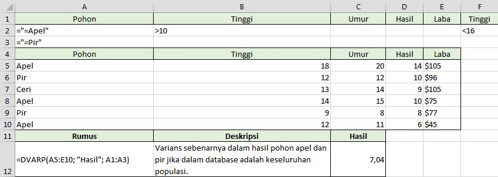

# DVARP

## Apa itu DVARP ?

Fungsi DVARP merupakan salah satu dari fungsi Database.

## Apa fungsi dari DVARP ? 

Menghitung varians populasi berdasarkan populasi keseluruhan dengan menggunakan angka dalam bidang \(kolom\) rekaman dalam daftar atau database yang cocok dengan kondisi yang Anda tentukan.

## Sintaks

```text
DVARP(database; field; criteria)
```



Rentang sel yang membentuk daftar atau database. Database adalah daftar dari data yang terkait di mana baris-baris informasi terkait adalah rekaman, dan kolom-kolom data adalah bidang. Baris pertama daftar tersebut berisi label untuk masing-masing kolom.



Mengindikasikan kolom yang digunakan dalam fungsi tersebut. Masukkan label kolom yang dimasukkan di antara dua tanda kutip ganda, seperti "Umur" atau "Hasil," atau angka \(tanpa tanda kutip\) yang menyatakan posisi kolom di dalam daftar: 1 untuk kolom pertama, 2 untuk kolom kedua, dan seterusnya.



Rentang sel berisi kondisi yang Anda tentukan. Anda dapat menggunakan rentang untuk argumen kriteria, selama meliputi setidaknya satu label kolom dan setidaknya satu sel di bawah label kolom di mana Anda menentukan kondisi untuk kolom tersebut.



## Contoh



### Keterangan



```text
=DVARP(A4:E10; "Hasil"; A1:A3)
```





`A4:E10` menunjukan database atau data dan informasi meliputi baris dan kolom. Dalam kasus ini yaitu data Pohon, Tinggi, Umur, Hasil, dan Laba.



`"Hasil"` Mengindikasikan kolom yang digunakan dalam fungsi tersebut. Dalam kasus ini adalah Hasil.



`A1:A3` merupakan sel yang berisi kriteria atau syarat yang ditentukan sendiri. Dalam kasus ini, varians sebenarnya dalam hasil pohon apel dan pir jika dalam database adalah keseluruhan populasi.



