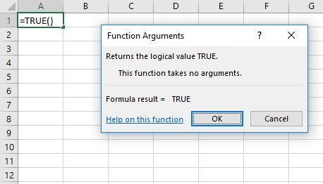
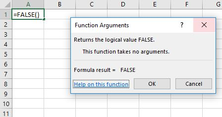
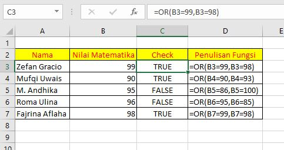
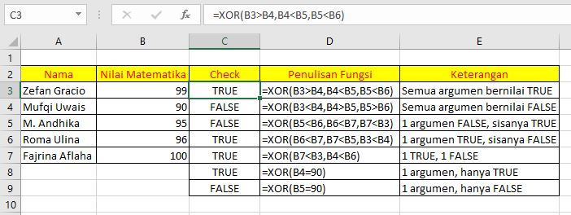
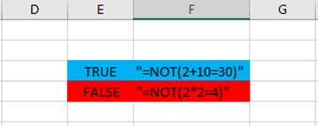
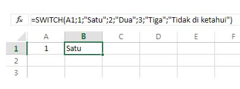

# Built-in Function Logika di Microsoft Excel

1. Fungsi AND
2. Fungsi TRUE
3. Fungsi FALSE
4. Fungsi OR
5. Fungsi XOR
6. Fungsi IF
7. Fungsi IFERROR
8. Fungsi IFNA
9. Fungsi NOT
10. Fungsi SWITCH

Kami akan menjelskan syntax dan parameter yang dibutuhkan dari fungsi diatas.

### 1. Fungsi AND

       Fungsi AND adalah fungsi yang digunakan untuk menyatakan logika yang ditentukan benar atau salah. Parameter yang digunakan dan contohnya sebagai berikut:

```text
=AND(logika1;logika2;..............logika_ke_n)
```


Pada contoh diatas, jika logika lebih dari dua dan salah satunya salah maka nilainya akan FALSE, begitu juga seterusnya, nilai TRUE akan muncul jika semua logika benar.

### 2. Fungsi TRUE

       Fungsi TRUE adalah fungsi yang digunakan untuk mengembalikan nilai TRUE/BENAR. Fungsi ini tidak memerlukan parameter. Berikut cara penulisannya,

```text
=TRUE()
```



### 3. Fungsi FALSE

       Fungsi FALSE adalah fungsi yang digunakan untuk mengembalikan nilai FALSE/SALAH. Fungsi ini tidak memerlukan parameter. Berikut cara penulisannya,

```text
=FALSE()
```



### 4. Fungsi OR

       Fungsi OR adalah fungsi yang digunakan untuk mengembalikan nilai TRUE jika 1 atau lebih argumen bernilai BENAR, tetapi akan mengembalikan nilai FALSE jika tidak ada argumen yang BENAR. Fungsi ini dapat menampung 255 argumen atau kondisi. Berikut cara penulisannya,

```text
=OR(logika-1,logika-2,logika-3,...,logika-n)
```



      Dapat dilihat bahwa sel C3 bernilai true karena 1 kondisi yaitu B3=99 bernilai BENAR/TRUE. Sel C6 bernilai false karena semua argumen/kondisinya bernilai SALAH/FALSE.

### 5. Fungsi XOR

       Fungsi XOR adalah fungsi yang digunakan untuk mengembalikan nilai TRUE jika:

1. Semua argumen bernilai TRUE
2. Jika terdapat 3 argumen atau lebih, dan 1 argumen TRUE sisanya FALSE
3. Jika terdapat 2 argumen, 1 TRUE dan 1 FALSE
4. Jika terdapat 1 argumen bernilai TRUE

      Dan akan mengembalikan nilai FALSE jika:

1. Semua argumen bernilai FALSE
2. Jika terdapat 3 argumen atau lebih, dan 1 argumen FALSE sisanya TRUE
3. Jika terdapat 1 argumen bernilai FALSE

      Berikut penulisannya,

```text
=XOR(logika-1,logika-2,logika-3,...,logika-n)
```



### 6. Fungsi IF

       Fungsi IF digunakan untuk menguji logika tertentu di exel, fungsi IF akan menghasilkan nilai TRUE jika kondisi yang ditentukan terpenuhi, dan bernilai FALSE jika kondisi yang ditentukan tidak terpenuhi, untuk melakukan uji logika pada exel fungsi IF biasanya menggunakan operator &lt;,&lt;=,=,=&gt;, dan &gt;. Parameter dan contoh penggunaan fungsi IF sebagai berikut:

```text
=IF(logika_test;nilai_jika_benar;nilai_jika_salah)
```


Berdasarkan contoh diatas if juga bisa digunakan berulang, dan ada if lagi pada nilai yang salah atau yang benar, dan begitu juga seterusnya, if yang seperti ini disebut dengan nested IF.


### 7. Fungsi IFERROR

          Fungsi IFERROR adalah fungsi yang digunakan untuk menghasilkan nilai tertentu jika rumus yang kita tentukan terdapat error. Parameter dan contoh penggunaan fungsi IFERROR adalah sebagai berikut:

```text
=IFERROR(Nilai;Nilai jika error)
```


  
Berdasarkan contoh diatas, jika terjadi error maka penulisan kesalahan bisa dikoreksi dengan tulisan optional dengan pernyataan yang di buat.


### 8. Fungsi IFNA

          Fungsi IFNA adalah fungsi yang digunakan untuk mengganti nilai error N/A menjadi pernyataan yang kita inginkan, Parameter dan contoh dari fungsi IFNA sebagai berikut :

```text
=IFNA(value,value_if_na)
```


  
Berdasarkan contoh diatas biasanya fungsi IFNA sering di gabungkan dengan VLOOKUP, karena fungsi VLOOKUP yaitu memeriksa data ada atau tidak, jika tidak ada akan muncul error \#N/A dan fungsi IFNA berguna untuk mengubah hasil dari error \#N/A menjadi suatu pernyataan.


### 9. Fungsi NOT

  
Fungsi NOT adalah fungsi yang digunakan untuk membalikan nilai yang awalnya TRUE menjadi FALSE dan berlaku sebaliknya, Parameter dan contohnya sebagai berikut :

```text
=NOT(logika)
```



Berdasarkan contoh diatas, fungsi NOT hanya bisa digunakan pada satu argument atau logika, tidak bisa secara dua sekaligus.

### 10. Fungsi SWITCH

        Fungsi SWITCH adalah fungsi yang digunakan untuk mengevaluasi satu nilai terhadap daftar nilai, dan mengembalikan hasil yang terkait dengan nilai cocok pertama. Jika tidak terdapat kecocokan, nilai default opsional mungkin dikembalikan. Fungsi ini mirip dengan switch case bahasa pemrograman c. Berikut penulisannya,

```text
=SWITCH(ekspresi,nilai-1,hasil-1,nilai-2,hasil-2,...,default)
```




